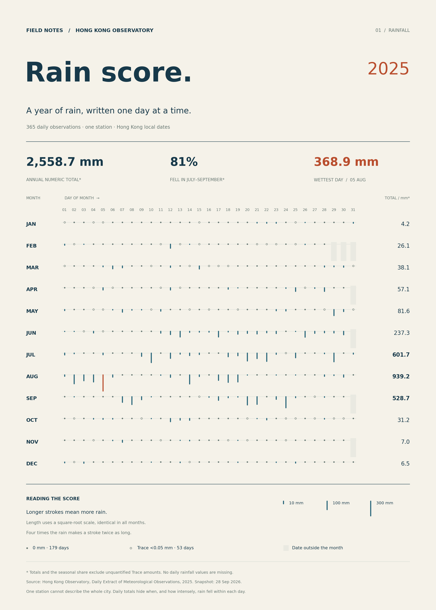

# Hong Kong Rain Score · 香港雨谱

**A year of rain, written one day at a time.**

[Explore the interactive website →](https://seven39c5bb.github.io/hong-kong-rain-score/)



## The phenomenon

Rain changes the pace of a city: stretches of dry days are interrupted by showers and concentrated downpours. This project turns a complete year of daily rainfall at the **Hong Kong Observatory station** into a twelve-line score. A complete 2025 calendar makes the contrast between months visible without treating the unfinished part of 2026 as dry weather. The score asks one question: **how was the year's rainfall distributed across time?**

## The source

The observations come from the Hong Kong Observatory's [Daily Extract of Meteorological Observations](https://www.hko.gov.hk/en/cis/dailyExtract.htm?y=2025&m=1). The [published annual file](https://www.hko.gov.hk/cis/dailyExtract/dailyExtract_2025.xml) was downloaded on **28 September 2026** and is committed unchanged as `data/dailyExtract_2025.xml`. Despite its `.xml` extension, its contents are JSON. It contains **365 daily rows**, grouped into 12 months, plus 24 monthly total/reference rows. Each daily row describes one local calendar day and has 12 columns. The ninth column (zero-based index 8) is the Observatory's **total rainfall in millimetres**; other columns include observations from other stations and are not used here.

The original source HTML is also cached, unchanged, as `data/dailyExtract-source.html`. It documents the column order and defines **Trace as rainfall below 0.05 mm**. There are 53 trace days, 179 days with exactly 0.0 mm, 133 days with a positive numeric amount, and no missing daily rainfall values. Trace amounts are not assigned invented values. `data/provenance.json` records source URLs and SHA-256 hashes; it is project metadata, separate from the raw responses. Data credit: Hong Kong Observatory, Government of the Hong Kong Special Administrative Region.

## What the picture shows

Of the year's **2,558.7 mm of numeric rainfall, 80.88% fell in July–September**; August alone accounts for 939.2 mm, and the largest daily value is 368.9 mm on 5 August. The twelve rows reveal long quiet stretches and concentrated wet periods, with one common scale across every month. The picture hides differences across Hong Kong and the timing and intensity of rain within each day; a single year's seasonal concentration is not evidence of a long-term climate trend.

## Reading the score

- Read months from top to bottom and day numbers from left to right. Adjacent rows are separate months, not overlapping time series.
- A downward blue stroke represents numeric rainfall. Its length is proportional to the **square root of the daily amount**: four times the rainfall makes a stroke twice as long. This deliberately compresses extremes so light rain remains visible. The displayed examples use that same scale.
- The orange stroke marks the year's highest daily amount. Colour otherwise carries no additional variable.
- A small filled dot means exactly zero; an open circle means Trace, not zero. Pale blocks mark dates that do not exist in that month.
- Monthly and annual totals and the July–September percentage exclude unquantified trace amounts. The parser verifies each monthly numeric sum against HKO's published monthly total.

The first [linear daily chart](out/baseline.png) is retained as a comparison. The final score is available as a [PNG](out/rain-score.png) and an [SVG](out/rain-score.svg). Both are generated from the same committed observations; there is no random decoration or synthetic weather.

## Run

```bash
uv run plot.py
```

## Website

The [GitHub Pages edition](https://seven39c5bb.github.io/hong-kong-rain-score/) lets readers inspect each day, focus on a month, and compare square-root and linear scales. Keyboard arrows move between days; the current value stays visible while scrolling. The page is responsive, with a horizontally scrollable score on narrow screens. It uses local styles, scripts and observations, with no external fonts, libraries or live weather calls. Its complete chart remains visible without JavaScript.

Generate the page locally, then open `site/index.html`:

```bash
uv run build_site.py
```

Every push to `main` rebuilds `site/` from the committed data and deploys it through `.github/workflows/pages.yml`. The generated `site/` directory is ignored by Git; the source template, styles and interactions live in `assets/`. PNG and SVG outputs remain committed for the assignment README.

## Process

See [PROCESS.md](PROCESS.md) for AI involvement, decisions retained and rejected, and validation. The project starts from [the course's assignment 2 template](https://github.com/sd5913/assignment-2-template); its temperature example has been replaced with the rainfall workflow.

---

**中文简介：** 把香港天文台站 2025 年的每日降雨排成十二行“雨谱”。雨线越长，雨量越大；长度采用统一的平方根尺度，让小雨也能被看见。实心点是零降雨，空心圆是小于 0.05 mm 的微量降雨，橙色线标出全年最大单日雨量。图中的总量与占比不包含无法量化的微量降雨。作品呈现一个测站一年的时间分布，不代表全港各区，也不说明长期气候趋势。
